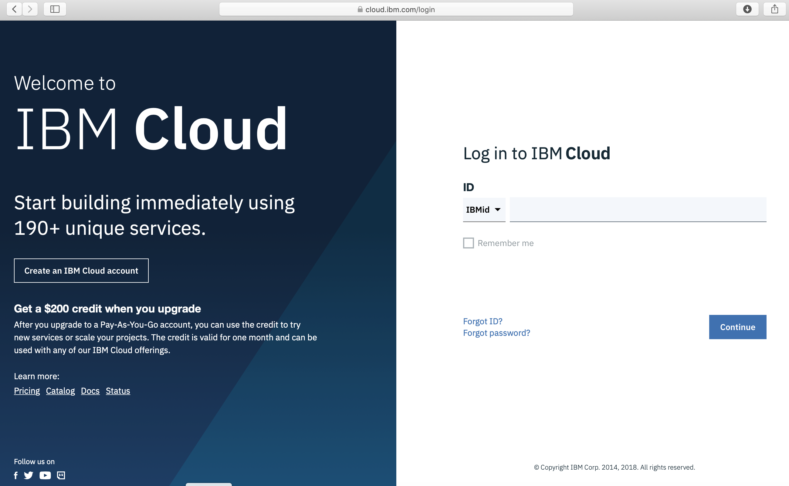

# Running a Windows deployment
### Purpose
This scenario considers the provisioning of a sample Windows based instance, accessing it over a public routable IP using remote desktop protocol

## VPC Functional Coverage
| Function | Result | Notes |
| -------- | ------ | ----- |
| VPC | :white_check_mark: | |
| Floating IPv4 | :white_check_mark: | |
| Subnet & BYO Private IP | :white_check_mark: | |
| Dedicated VSI support | :white_check_mark: | |
| Multiple Network Interfaces in VSI | :white_check_mark: | |
| Windows VSI support | :white_check_mark: | |
| Security groups | :white_check_mark: | |
| Multiple Network Interfaces in VSI | :white_check_mark: | | |


### Architecture


### Documented Steps VPC infrastructure using the IBM Cloud console

### Login to IBM Cloud
Use IBMid or Softlayer ID as appropiate, notice that not all accounts have access to VPC infrastructure, please confirm with your IBM Cloud account master user.




### 1. Create the base VPC and the base subnet for the virtual server deployment.

Go to the VPC Getting Started External link icon page in IBM Cloud console.


1. Click Create VPC on the Getting Started page.
2. Enter a name for the VPC, such as DemoWindows.
3. Select or create the default ACL for new subnets in this VPC. In this tutorial, let's create a new default ACL. We'll configure rules for the ACL later.
4. Enter a name for the new subnet in your VPC, such as DemoSubnet
5. Select a location for the subnet. The location consists of a region and a zone.
6. Enter an IP range for the subnet in CIDR notation, for example: 10.240.0.0/18.
7. Select an ACL for the subnet. Let's select Use VPC default to use the default ACL that's created for this VPC.
8. Click Create virtual private cloud.


### 2. Confirm the VPC and subnet creation.


### Create an SSH Key

An SSH key is required when creating a VPC instance. Copy the ssh public key you wish to use to vpc-key.pub and click over Add SSH Key to fill out the Name, Region and Public key contents, after that confirm that the key has been created.


### 4. Create the base instance for Windows deployment

To create a virtual server instance in the newly created subnet:

1. Click **Virtual server instance** in the navigation pane and click **New instance**.
1. Enter a name for the instance, such as `DemoWindows`.
1. Select the VPC that you created.
1. Note the **Location** field (read-only) that shows the location of the subnet on which the instance is created.
1. Select an image (that is, operating system and version) such as Windows Server.
1. To set the instance size, select one of the popular profiles or click **All profiles** to choose a different core and RAM combination that's most appropriate for your workload.
1. Select an existing SSH key or add an SSH key that will be used to access the virtual server instance.
1. In the **Network interfaces** area, you can change the name and port speed of the interface. If you have more than one subnet in your VPC, you can select the subnet that you want to attach to the instance.

You can also select which security groups to attach to this instance. By default, the VPC's default security group is attached. The default security group allows inbound SSH and ping traffic, all outbound traffic, and all traffic between instances in the group. All other traffic is blocked; you can configure rules to allow additional traffic. If you later edit the rules of the default security group, those updated rules will apply to all current and future instances in the group.

Click **Create virtual server instance**.


### 5. Reserve a floating IP and assign it to the required instance

Reserve and associate a floating IP address to enable your instance to be reachable from the internet
**Tip:** Your instance must be running before you can associate a floating IP address. It can take a few minutes for the instance to be up and running.

To reserve and associate a floating IP address:

1. In the left navigation pane, click **Floating IP**.
1. Click **Reserve floating IP**.
1. Select the instance that you created and its network interface that you want to associate with the floating IP address.
1. Click **Reserve IP**. The new IP address is displayed on the Floating IPs page.


### 7. Check security groups attached to VPC circuit

You can configure the security group to define the inbound and outbound traffic that is allowed for the instance.

To configure the security group:

1. On the Virtual server instances page, click your new instance to view its details.
1. In the **Network interfaces** section, click the security group.
1. Click **Add rule** to configure inbound and outbound rules that define what traffic is allowed to and from of the instance. For each rule, specify the following information:  
   * Select which protocols and ports the rule applies to.   
   * Specify a CIDR block or IP address for the permitted traffic. Alternatively, you can specify a security group in the same VPC to allow traffic to or from all instances of the selected security group.    

   **Tips:**  
  * All rules are evaluated, regardless of the order in which they're added.
  * Rules are stateful, which means that return traffic in response to allowed traffic is automatically permitted. For example, a rule that allows inbound TCP traffic on port 80 also allows replying outbound TCP traffic on port 80 back to the originating host, without the need for an additional rule.
1. _Optional:_ If you want to attach this security group to other instances, click **Attached interfaces** in the navigation pane  and select additional interfaces.
1. When you finish creating rules, click the **All security groups** breadcrumb at the top of the page.

### Example security group  

For example, you can configure inbound rules that do the following:

 * Allow all SSH traffic (TCP port 22)
 * Allow all ping traffic (ICMP type 8)

Then, configure outbound rules that allow all TCP traffic.


### 8. Check current rules for security groups in the VPC (Remote desktop protocol port is 3389)


In case that the port is not open, use the following example to open the necessary port:


### 9. Connect to the instance using Remote Desktop protocol using the floating IP as target with any Remote desktop client.


* To properly connect get encrypted password from UI and saved to a file

* decode it using:
```
cat UI_PASSWORD_FILE  | base64 --decode > decoded_base64_password_file
```
Decrypt it using the SSH key used to create the instance:
```
 openssl pkeyutl -in decoded_base64_password_file -decrypt -inkey ~/.ssh/id_rsa -pkeyopt rsa_padding_mode:oaep -pkeyopt rsa_oaep_md:sha256 -pkeyopt rsa_mgf1_md:sha256 > finalpass
 ```
```
cat finalpass
```

### Error Scenarios

### Documentation Provided

[VPC documentation](hhttps://cloud.ibm.com/docs/vpc-on-classic?topic=vpc-on-classic-getting-started)
